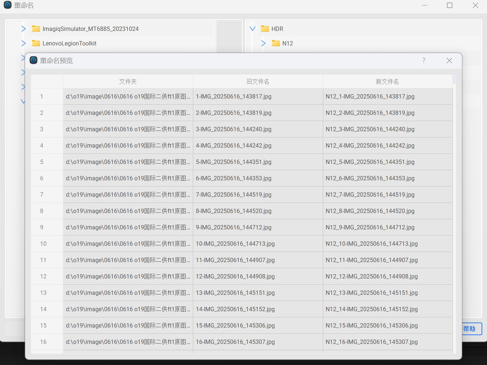
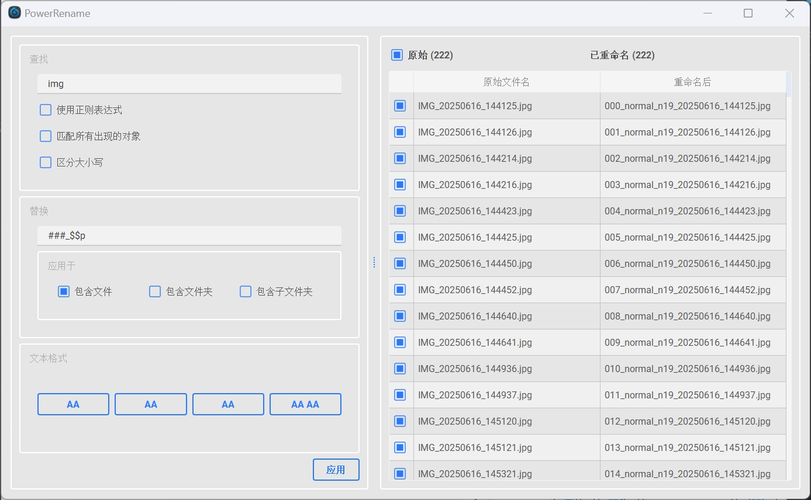

# Rename工具

一个基于 PyQt5 的批量重命名工具。

# 预览



## 📋 项目概述
本工具面向需要高效批量重命名的用户（图像/视频整理、数据集准备、日志归档等场景），提供“所见即所得”的预览与安全可控的重命名流程：

- 目标与优势：
  - 在不离开资源管理器的前提下，通过全局热键把“当前选中项”快速注入工具（支持文件与文件夹）。
  - 采用 oleacc/MSAA 作为主方案直接读取资源管理器选中项，稳定且不依赖剪贴板；失败时自动回退至 COM 方案。
  - 强化预览体验：可勾选逐行启用/禁用、自然排序、按文件夹分组编号、日期与文件夹占位符等。

- 核心功能：
  - 查找/替换（支持正则、大小写、匹配全部/首个）。
  - 命名模板：`#` 连号、`#=N` 起始值、`$p`/`$$p` 文件夹占位、`$YYYY/$MM/$DD` 日期占位、`*` 保留原名。
  - 可视化预览与单行勾选，避免误操作；右侧“白名单视图”仅呈现将参与操作的对象。
  - PowerRename 子窗口：专注批量命名的轻量 UI，随时弹出与关闭，不影响主窗口。

- 典型工作流：
  1) 在资源管理器中选中文件/文件夹 → 按 `Ctrl+M` 打开 PowerRename 或 `Ctrl+N` 打开主窗口并注入路径。
  2) 在 PowerRename/主窗口中设置模板与规则，查看预览与勾选，确认后应用。
  3) 如需调整作用范围，可在主窗口左侧树“增加/移除”控制右侧白名单，再次预览/应用。

- 技术要点：
  - 选中项采集：优先 oleacc/MSAA + ListView 消息获取选中项名称，再用 COM 仅读取当前文件夹路径进行拼接；失败回退 COM `SelectedItems()`。
  - UI 框架：PyQt5 + `qt_material` 主题；右侧基于 `ExcludeFilterProxyModel` 实现白/黑名单与祖先/后代可见性。
  - 健壮性：过滤打包目录（`.dist`/`.onefile-temp` 等）避免自伤；自然排序与大小写还原以贴近用户直觉。

## 运行环境与依赖

- Windows 10/11（使用 Windows API、MSAA、COM 等）。
- Python 3.12+（建议）。
- 依赖库：
  - `PyQt5`
  - `qt_material`
  - `pywin32`（`win32com.client` / `pythoncom`）
  - Windows 自带 `ctypes`

安装示例：
```bash
pip install PyQt5 qt-material pywin32
```


## 启动与使用

### 启动程序

- 方式一：直接运行重命名工具
```bash
python rename_single.py
```
- 程序启动后默认驻留系统托盘，不立即显示主窗口（右下角托盘图标可双击唤出）。

### 快捷键（全局）

- `Ctrl+M`：优先使用资源管理器中当前“选中项”打开 PowerRename 窗口（不唤起主窗口）。
- `Ctrl+N`：优先使用资源管理器中当前“选中项”将路径带入主窗口并显示主窗口。

注意：若资源管理器无选中项，则回退使用左侧选择；再回退使用右侧当前可见文件。

### 主窗口与右侧列表

- 左侧：文件系统树，可多选。点击“增加”将选中内容加入右侧视图。
- 右侧：基于白名单显示的文件视图，仅显示“加入”的文件/文件夹（及其子项）。
- 右下状态栏：输入规则（如 `$p_*`、`$$p_*`、`#_*`）及按钮（开始、预览、PowerRename、帮助）。

### PowerRename 窗口

- 右侧可见文件可以直接启动 PowerRename；或通过 `Ctrl+M` 快速基于资源管理器选中项打开。
- 查找/替换规则：
  - 支持正则、区分大小写、匹配所有出现对象。
  - 替换文本支持特殊占位：
    - `#` 数字序号（`##`、`###` 等可设定位宽）。
    - `#=N` 起始序号（如 `##=10` 从 10 开始两位数）。
    - `$p` 当前文件夹名；`$$p` 上一级_当前两级文件夹拼接。
    - `$YYYY/$MM/$DD`（或小写）日期组件。
  - “应用于”可选择只对文件名生效（或保留原名）。
  - 预览表格左列勾选控制是否对该行生效。


## 资源管理器选中项获取（oleacc 主方案）

- 函数：`FileOrganizer._get_explorer_selected_paths`
- 优先方案（oleacc / MSAA + ListView 消息）：
  1. 通过 `GetForegroundWindow`/`GetAncestor` 获取当前活动的 Explorer 根窗口句柄。
  2. 遍历层级定位 `SHELLDLL_DefView` → `SysListView32`。
  3. 使用 `LVM_GETNEXTITEM`/`LVM_GETITEMTEXTW` 获取“已选”项的显示名称。
  4. 仅用 COM 读取“当前文件夹路径”进行拼接，得到完整路径（保留大小写、过滤应用目录）。
- 回退方案（COM / Shell.Application）：
  - 找到活动 `explorer.exe` 窗口，读取 `Document.SelectedItems()` 的 `Path` 列表。
- 完全不依赖剪贴板；对不同 UI 层级结构做了健壮性处理；避免把程序自身目录误带入。


## 重命名规则（主窗口“开始/预览”）

- 规则输入位于状态栏 `QComboBox`，内置示例：`$p_*`、`$$p_*`、`#_*`。
- `#` 表示序号，连续 `#` 表示固定位数，按文件夹内自然排序，从 0（或 PowerRename 中可设定起始）开始。
- `*` 表示保留原始文件名。
- `$p`/`$$p` 表示（父_）当前文件夹名拼接。


## 常见问题（FAQ）

- 全局热键注册失败？
  - 提示“RegisterHotKey 失败”，可能被占用或无权限。尝试关闭同类软件或以管理员运行。
- 读取不到资源管理器选中项？
  - 请确保前台是 Explorer 窗口且有选中项；某些非标准视图/第三方外壳可能不兼容 oleacc 路径，会自动回退到 COM 方案。
- 右侧没有可重命名文件？
  - 使用“增加”将左侧选中加入右侧，或用 `Ctrl+M`/`Ctrl+N` 从资源管理器注入路径。


## 代码关键点

- `FileOrganizer.setup_global_hotkey`: 注册 `Ctrl+M`/`Ctrl+N` 并在原生消息中触发对应逻辑。
- `FileOrganizer.open_power_rename_from_explorer_or_fallback`: 路径获取与多级回退策略、右侧白名单同步、PowerRename 启动。
- `PowerRenameDialog`: 查找/替换/预览/应用重命名的完整交互界面。
- 过滤与显示：`ExcludeFilterProxyModel` 实现白名单/黑名单、祖先/后代可见性逻辑。


## 打包

- 可结合 `build.py`/`build_rename.py` 进行打包（如 PyInstaller/Nuitka 等）。
- 运行时会过滤自身程序目录（包括 `.dist`/`.onefile-temp` 等），避免误将应用文件带入重命名。


